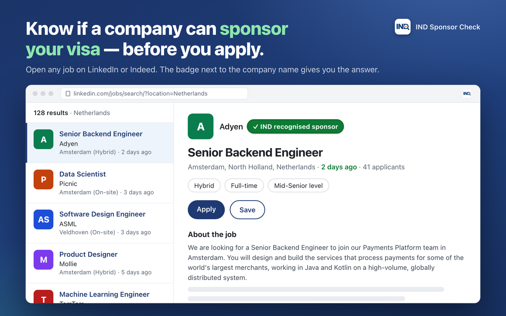
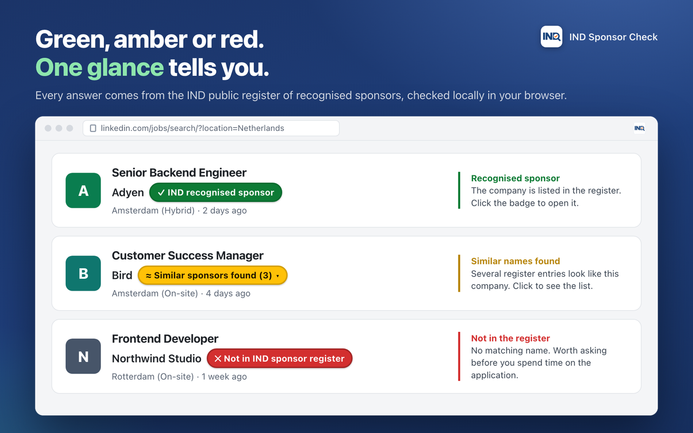
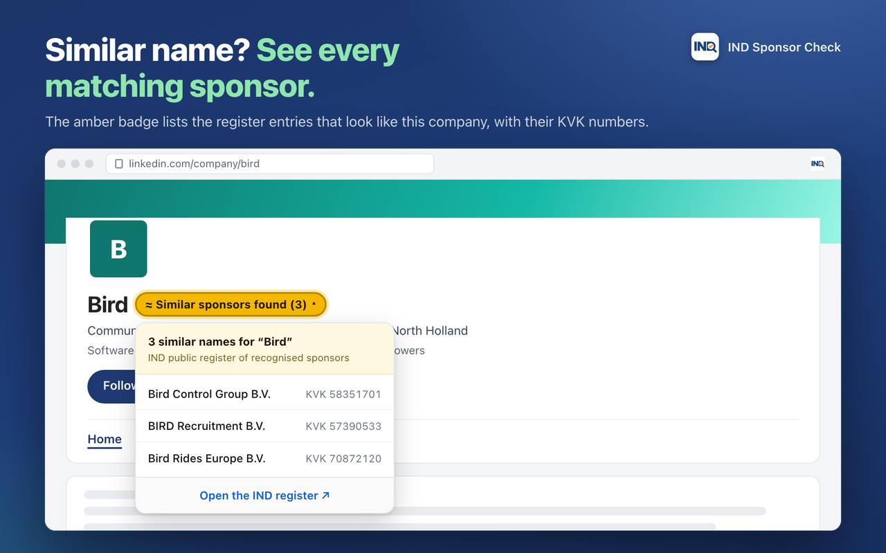
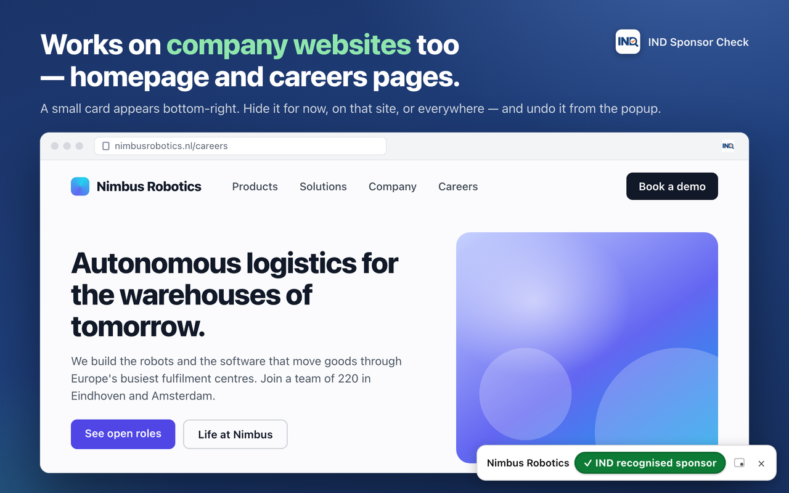
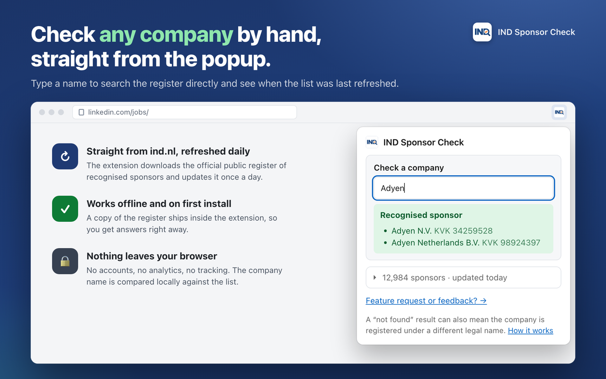

# IND Sponsor Check

Chrome extension (Manifest V3, React + Vite + [CRXJS](https://crxjs.dev)) that
adds a badge next to the company name on LinkedIn and Indeed job pages and
company pages, and a floating badge on company websites, telling you whether
that company is in the IND
[public register of recognised sponsors](https://ind.nl/en/public-register-recognised-sponsors/public-register-work).

## What it looks like

<table>
  <tr>
    <td width="50%"></td>
    <td width="50%"></td>
  </tr>
  <tr>
    <td></td>
    <td></td>
  </tr>
  <tr>
    <td></td>
    <td></td>
  </tr>
</table>

The images are rendered mock pages (`store/scenes/`), not captures of real
accounts.

```
src/
  background/   service worker: downloads + caches the register, answers lookups
  content/      content script: finds the company name, injects the badge
  content/sites/  one adapter per job site (linkedin.ts, indeed.ts) + website.ts (JSON-LD)
  popup/        React popup: manual lookup, list status, refresh button
  intro/        React welcome page, opened once on install (also linked from the popup)
  assets/       icons and the screenshots the intro page imports (generated by `npm run shots`)
  shared/       pure logic (name normalisation, matching, HTML parsing, user prefs) — unit tested
  data/         bundled snapshot of the register (offline / first-run fallback)
supabase/       schema.sql for the remote settings table
store/          Chrome Web Store listing text, privacy policy, screenshot scenes + renders
scripts/        icon generator, snapshot updater, zip for upload
```

## How it works

1. On install (and then every `refresh_hours`, default 24h) the service worker
   reads the settings table from Supabase, downloads the page at `register_url`,
   parses the Organisation / KVK table and stores it in `chrome.storage.local`.
   Until the first download succeeds it uses the bundled snapshot in `src/data`.
   Every company lookup also kicks off this refresh opportunistically, so both
   the settings read and the register download are gated on age — otherwise the
   `ignored_hosts` table (a couple of thousand rows, paged) would be
   re-downloaded on every job page opened. Only the alarm, install and the
   popup's **Refresh now** button bypass the gate.
2. The content script watches the page DOM (both sites are single-page apps),
   finds the company name on the open job or company profile, and asks the
   service worker for a match. Supported pages:
   - LinkedIn: `/jobs/...` (detail pane or full page) and `/company/<slug>`
   - Indeed (any country subdomain): `/jobs?...&vjk=` detail pane, `/viewjob`,
     and `/cmp/<slug>`
   - Any other site not on the ignore list (search engines, social networks,
     dev tools and every Dutch government domain: see
     `src/shared/ignored-hosts.ts`, extended by the Supabase `ignored_hosts`
     table), when the page carries schema.org JSON-LD naming an organisation:
     a floating badge appears bottom-right. Two kinds of page qualify:
     - the homepage (`/` or a locale root like `/nl/`), where any
       `Organization` (or subtype) node describes the company itself;
     - any URL carrying a `JobPosting` with a `hiringOrganization` — a careers
       subpage, a Greenhouse or Lever board, an ATS. Only the hiring
       organisation is read there; other organisations on such a page belong to
       whoever runs the board, not to the employer.

     The legal name, name and alternate name are tried in that order. Pages
     without such data are left alone.
3. The floating badge's `×` opens a small menu: hide it for now, hide it on
   this site (the host is added to `mutedHosts`), or hide it on all company
   websites (`websiteBadge: false`). Those choices live in `chrome.storage.local`
   under `userPrefs`, separately from the Supabase-backed settings, and are
   undone from the popup. They only affect the generic website check; the
   LinkedIn and Indeed badges are not touched.
4. Matching normalises both names (lowercase, strip accents/punctuation, drop
   legal forms like `B.V.`, `N.V.`, `Holding`, `Netherlands`, `Koninklijke`...):
   - identical → **✓ recognised sponsor**
   - one is a word-prefix of the other (`ING` vs `ING Bank`) → **≈ likely**
   - otherwise → **✕ not found**

## Setup

```bash
npm install
npm run icons        # only after changing src/assets/icons/logo.png (needs Pillow: pip install pillow)
cp .env.example .env # optional: fill in Supabase URL + anon key
npm run build        # -> dist/
```

Load it in Chrome: `chrome://extensions` → enable **Developer mode** →
**Load unpacked** → pick the `dist` folder. Open any LinkedIn job.

For development with hot reload run `npm run dev` and load the same `dist`
folder; CRXJS rebuilds on save.

### Remote settings (Supabase)

Without a `.env` the extension works with the built-in defaults. To control the
register URL remotely:

1. Create a Supabase project, open **SQL Editor** and run `supabase/schema.sql`.
2. Copy **Project URL** and the **anon public** key from *Project Settings →
   API* into `.env`, then rebuild.
3. Edit values in **Table Editor → settings**:

| key                 | meaning                                                                 |
|---------------------|-------------------------------------------------------------------------|
| `register_url`      | IND page to download and link to                                        |
| `refresh_hours`     | how often to re-download (1–720)                                        |
| `sponsors_json_url` | optional JSON list to use instead of parsing the page (leave empty)     |

The same SQL also creates the `ignored_hosts` table (one registrable domain
per row, no `www.`; subdomains are covered). Add a row to silence the
company-website check on a site; the bundled defaults in
`src/shared/ignored-hosts.ts` always apply as well. Rows are grouped by
`category`:

| category     | rows | what it covers                                                        |
|--------------|------|-----------------------------------------------------------------------|
| `everyday`   |  ~46 | search, social, video, shopping, dev tools, the other job sites        |
| `government` | ~2000| every Dutch ministry, agency, municipality, province and water board   |

Run `supabase/seed-government-hosts.sql` after `schema.sql` to load the
government set. It is generated from the [Open State Foundation
dataset](https://github.com/openstate/datasets/tree/master/government_domain_names),
which is compiled from the official Websiteregister Rijksoverheid and the
Overheidsalmanak. Private vendors that appear in that register only because
government uses them (for example `arcgis.com`) are excluded, so the badge
still works on their own sites.

To drop a site back in, delete its row:

```sql
delete from public.ignored_hosts where host = 'rijkswaterstaat.nl';
```

The anon key only grants `SELECT` on these tables (see the RLS policies in the SQL).

If IND ever moves the register to a domain other than `ind.nl`, either host a
JSON copy in Supabase Storage and point `sponsors_json_url` at it, or add the
new domain to `host_permissions` in `manifest.config.ts` and release an update.

## Scripts

| command            | what it does                                                  |
|--------------------|---------------------------------------------------------------|
| `npm run dev`      | Vite dev server with extension hot reload                     |
| `npm run build`    | type-check + production build into `dist/`                    |
| `npm test`         | unit tests (vitest)                                           |
| `npm run icons`    | regenerate the PNG icons from `logo.png` (needs Pillow)       |
| `npm run snapshot` | refresh `src/data/sponsors-snapshot.json` from ind.nl         |
| `npm run shots`    | render the store + intro screenshots from `store/scenes/` (needs `npm run dev`) |
| `npm run zip`      | zip `dist/` into `release/` for the Chrome Web Store          |

## Security notes for contributors

- Never commit `.env`. Only `.env.example` is tracked (see `.gitignore`).
- The Supabase **anon** key is designed to be public and ends up inside the
  built extension anyway; it can only `SELECT` from `settings` because of the
  RLS policy in `supabase/schema.sql`. Never put the `service_role` key in
  this project.
- `src/data/sponsors-snapshot.json` is public data from the IND register.

## When a site changes its markup, or to add a site

Each site is one file in `src/content/sites/` implementing `SiteAdapter`
(URL → page kind, DOM → company name element). Add the new selector to the top
of the relevant list, or add a new adapter and register it in
`src/content/sites/index.ts` plus `matches` in `manifest.config.ts`. Run
`npm test`; the adapter tests use small HTML fixtures copied from the live
pages.

## Contributing

Issues and pull requests are welcome. Please run `npm test` and `npm run build`
before opening a PR. Licensed under MIT.
